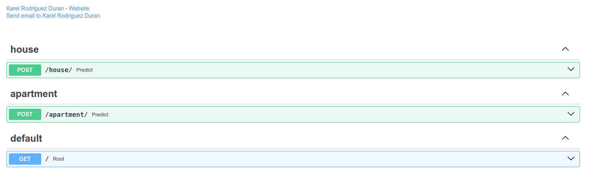

<h1 align="center"> IMMO Eliza API </h1>
<p align="center">
    
</p>

## Table of Contents
- [Table of Contents](#table-of-contents)
- [Mission](#mission)
- [Overview](#overview)
- [How to use](#how-to-use)
- [Dependencies](#dependencies)
- [Project structure](#project-structure)
- [Personal situation](#personal-situation)

## Mission

The real estate company Immo Eliza is really happy with your regression model and current work up to now.

They would like you to create an API so their web developers can access the predictions whenever they need to. They also want to have a small web application for the non-technical employees and possibly their clients to use. The API and the web application should be intertwined but separate.

## Overview

These are two small APIs, which allow predicting the price of a property, house or apartment. For this it uses XGBoost Regression model previously trained with real data obtained from the <a href="https://www.immoweb.be/">Immoweb website</a>.

These APIs were deployed on <a href="https://render.com/">Render</a> and are accessible through:

https://property-price-predict-api.onrender.com/house/

https://property-price-predict-api.onrender.com/apartment/

## How to use

Depending on whether you want to predict the price of a house or an apartment, you must make a POST request to the corresponding URL and provide the appropriate JSON.
```python
    requests.post(<url to the correct API>, json=data)
```

<table>
<tr>
  <td>
    JSON format for Houses:
  </td>
  <td>
    JSON format for Apartments:
  </td>
</tr>
<tr>
    <td>
<pre>
{
    "facades": int,
    "habitable_surface": float,
    "bedroom_count": int,
    "bathroom_count": int,
    "toilet_count": int,
    "room_count": int,
    "kitchen_type": "string",
    "furnished": bool,
    "terrace": bool,
    "garden_exists": bool,
    "state_of_building": "string",
    "living_surface": float,
    "epc": "string",
    "consumption_per_m2": float,
    "province": {
        "name": "string"
    },
    "land_surface": float
}
</pre>
</td>
<td>
<pre>
{
    "facades": int,
    "habitable_surface": float,
    "bedroom_count": int,
    "bathroom_count": int,
    "toilet_count": int,
    "room_count": int,
    "kitchen_type": "string",
    "furnished": bool,
    "terrace": bool,
    "garden_exists": bool,
    "state_of_building": "string",
    "living_surface": float,
    "epc": "string",
    "consumption_per_m2": float,
    "province": {
        "name": "string"
    },
    "terrace_surface": float
}
</pre>
</td>
</tr>
</table>

The API returns the predicted price as a JSON object with the following structure:

```json
{
    "predicted_price": int
}
```

## Dependencies
    fastapi~=0.103.0
    uvicorn~=0.20.0
    pydantic~=2.6.4
    pandas~=2.2.1
    scikit-learn~=1.4.1.post1
    numpy~=1.26.4
    xgboost~=2.0.3

## Project structure
- [/](/) -- Root directory
  - [assets/](assets) -- Contains project assets
      - [images/](assets/images) -- Images used in project documentation
  - [ml/](ml) -- Machine Learning module 
    - [models/](ml/models) -- Trained machine learning models
    - [src/](ml/src) -- Source code for machine learning module
      - [data/](ml/src/data) -- Data preprocessing scripts
      - [models/](ml/src/models) -- Machine learning model scripts
  - [property/](property) -- Property module
    - [repository/](property/repository) -- Scripts for predicting property prices
    - [routers](property/routers) -- Router scripts for handling API requests
  - [main.py](main.py) -- Main script that runs the application
  - [README.md](README.md) -- Readme file
  - [requirements.txt](requirements.txt) -- Contains required packages by the project


## Personal situation
While doing this project I was part of the ARAI6 group of the <a href="https://becode.org/all-trainings/pedagogical-framework-ai-data-science/">AI Bootcamp</a> training organized by <a href="https://becode.org/">BeCode</a> in Ghent. 

______________________________________
  <br><sub><a href="https://www.linkedin.com/in/karel-rodriguez-duran/">Karel Rodríguez Durán</a></sub>